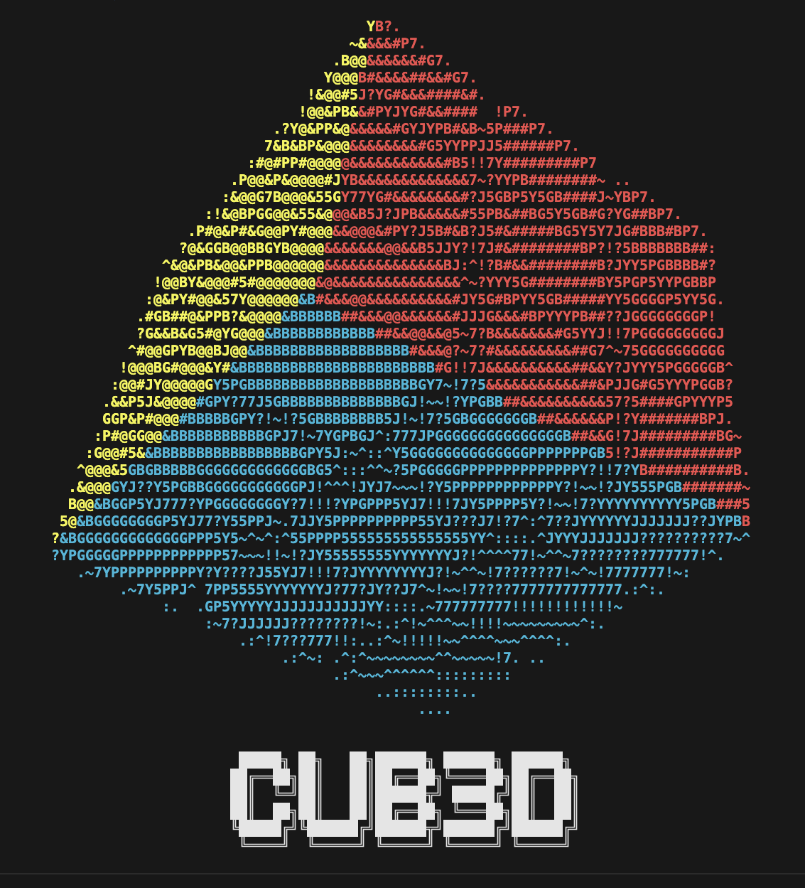
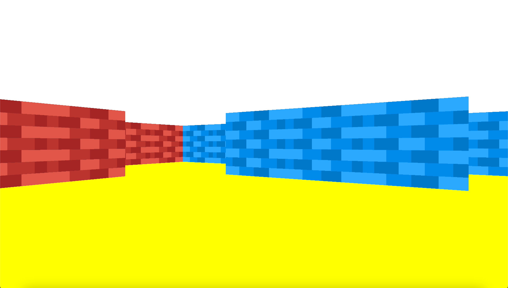
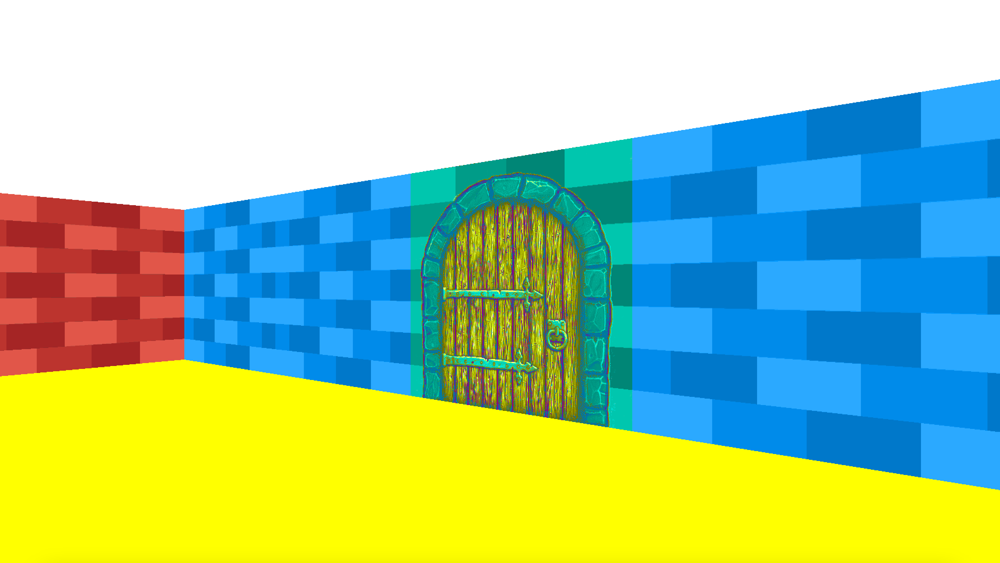

# 42-cub3d



Cub3D is a project developed as part of the curriculum at 42. It's a RayCaster implemented using [MLX42](https://github.com/codam-coding-college/MLX42#download-and-build---mlx42).

## Mandatory Part

To compile the Cub3D project, simply run the following command:

```bash
make
```

The program is executed with the following syntax:

```bash
./cub3D [map]
```

### Maps

Maps for Cub3D are text files ending with the extension `.cub`. The map syntax follows this format:

```bash
EA [path_to_PNG]
NO [path_to_PNG]
SO [path_to_PNG]
WE [path_to_PNG]

C [0-255],[0-255],[0-255]
F [0-255],[0-255],[0-255]

1111
10W1
1111
```

In this syntax:
- `EA`, `NO`, `SO`, and `WE` specify the paths to texture files for the east, north, south, and west walls respectively.
- `C` specifies the ceiling color in RGB format.
- `F` specifies the floor color in RGB format.
- The map layout is represented by numbers, where `1` are walls and `0` are fields you can walk on. Each field must be surrounded by walls.
- Only one spawn point of the player must be present, represented by `W`, `N`, `E`, or `S`, indicating the initial spawning orientation into the west, north, east, or south directions respectively.

You can find some basic maps in the `maps` directory. To run Cub3D with a specific map, use the following command:

```bash
./cub3D maps/[map]
```

### Controls

In Cub3D, players can explore the map using the `W`, `A`, `S`, and `D` keys, enabling movement and navigation through the maze-like environment.
You can close the game using the `ESC` key.

## Bonus Part

To compile the Cub3D bonus part, run the following command:

```bash
make bonus
```

In addition to the mandatory functionality, the bonus part cub3D_bonus introduces support for mouse movement and adds doors to Cub3D.

In the map syntax, the `2` represents a door. Doors can be opened by pressing the `E` key, allowing players to walk through them.

Therefore use the maps in the `maps/bonus` directory, they include doors.

```bash
./cub3D_bonus maps/bonus/[map]
```

## Showcase




